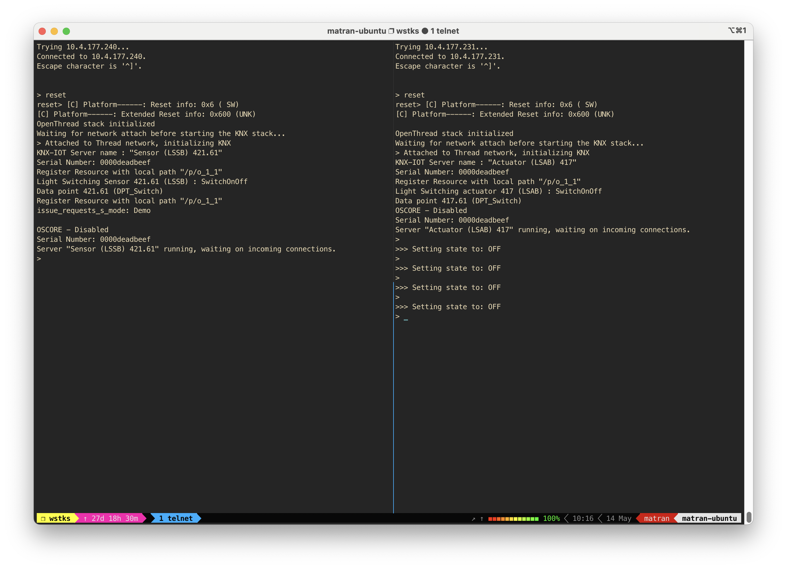
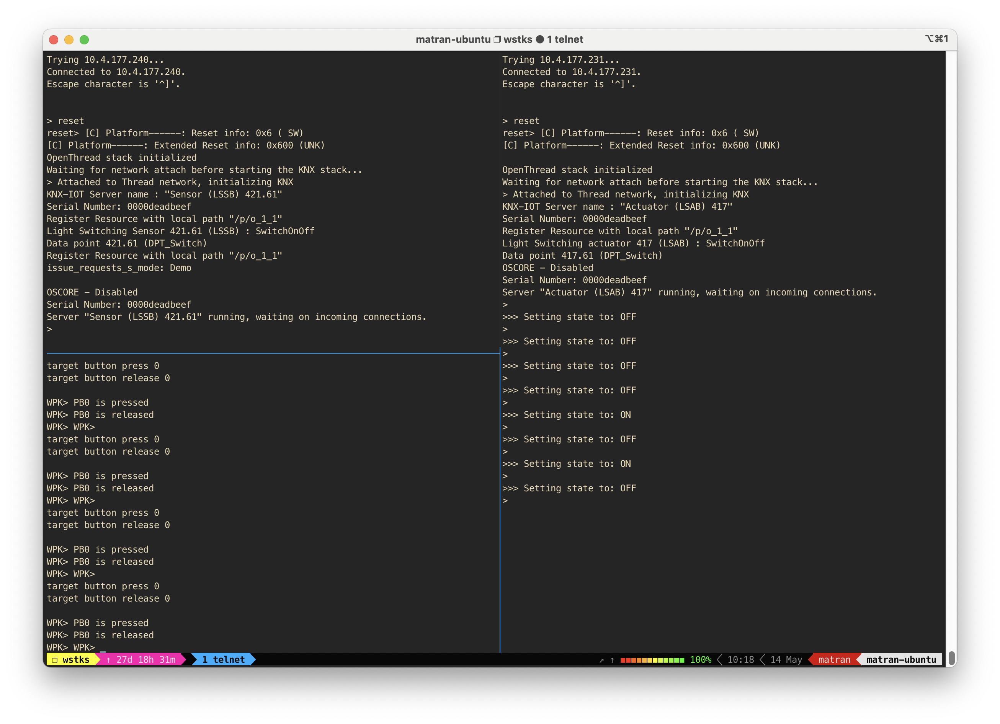

# KNX IoT OpenThread Light Switch Demo

This folder contains a technical demo that integrates the OpenThread network stack on EFR32 with the KNX IoT Point API. The demo consists of two applications: `ot-lightswitch-actuator` and `ot-lightswitch-sensor`. The `ot-lightswitch-sensor` application senses a press of `Button 0` on the EFR32 development kit and toggles the state of the actuator. The actuator's state is displayed on an LED and printed to the CLI console when toggled by the sensor.

## Bootstrap

To build these demo applications, you may need to install some prerequisites. If you are able to build for `ot-efr32`, running the bootstrap script is not necessary.

Install the prerequisites by running the bootstrap script from the root of the `KNX-IOT-STACK` repository:

```bash
./script/bootstrap
```

## Building

Build the `ot-lightswitch-sensor` and `ot-lightswitch-actuator` applications using the build script. Any Mighty Gecko board that is supported in GSDK release v4.4.0 should work.

```bash
./script/build brdXXXXy
```

#### Example: Building for brd4187c

```bash
export BOARD="brd4187c"
./script/build $BOARD
```

## Flashing

Flash the `ot-lightswitch-sensor` and `ot-lightswitch-actuator` applications to two separate boards:

```bash
export SENSOR_TARGET_IP="10.4.177.240"
export ACTUATOR_TARGET_IP="10.4.177.231"
commander flash --ip $SENSOR_TARGET_IP ./build/$BOARD/knx/samples/ot-lightswitch/ot-lightswitch-sensor.s37
commander flash --ip $ACTUATOR_TARGET_IP ./build/$BOARD/knx/samples/ot-lightswitch/ot-lightswitch-actuator.s37
```

## Testing

The `ot-lightswitch-sensor` and `ot-lightswitch-actuator` applications have hard-coded Thread network datasets and should automatically try to connect to each other to form a Thread network.

Once a device attaches to a Thread network (including when it becomes a leader with no children), the KNX stack will be initialized automatically. Once both devices have connected and KNX has been initialized, the devices are ready for KNX communication.



**NOTE:** You might notice that the actuator initially tries to set its state four times. The exact reasons for this behavior are unclear, but it could be related to the actuator restoring its previous state and synchronizing with the sensor's state. Further investigation is needed to understand the expected behavior as per the KNX specification.

```bash
>>> Setting state to: OFF
```

Pressing `Button 0` on the WSTK/WPK hosting the EFR32 running `ot-lightswitch-sensor` will toggle the state of the actuator on the EFR32 running `ot-lightswitch-actuator`. Alternatively, you can use the WSTK/WPK admin console to simulate a button press:

```bash
$ telnet 10.4.177.240 4902
Trying 10.4.177.240...
Connected to 10.4.177.240.
Escape character is '^]'.
WPK>
WPK> target button enable 0
WPK>
WPK> target button press 0
PB0 is pressed
WPK>
WPK> target button release 0
PB0 is released
```


